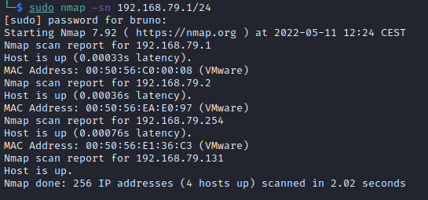

## Host Discovery

An attacker sends a probe to an IP address to determine if the host is alive. Host discovery is one of the earliest phases of network reconnaissance. The adversary usually starts with a range of IP addresses belonging to a target network and uses various methods to determine if a host is present at that IP address. Host discovery is usually referred to as 'Ping' scanning using a sonar analogy. The goal is to send a packet through to the IP address and solicit a response from the host. As such, a 'ping' can be virtually any crafted packet whatsoever, provided the adversary can identify a functional host based on its response. An attack of this nature is usually carried out with a 'ping sweep,' where a particular kind of ping is sent to a range of IP addresses.

There are many ways to perform a ping sweep, for a basic ping sweep with nmap, you can use the option -sn:

```
nmap -sn <network>/<cidr>
```


Running this command with sudo will add additional ping functionality such as ARP to find the MAC addresses of discovered hosts:



The basic host discovery method showed above might be good for internal networks, however, this method will be inneficient in other scenarios. The explanation of other methods for host discovery is out of the scope of this explanation as there are numerous other ways to accomplish this with nmap alone. Once our live host is identified we are ready to move to the next step.

