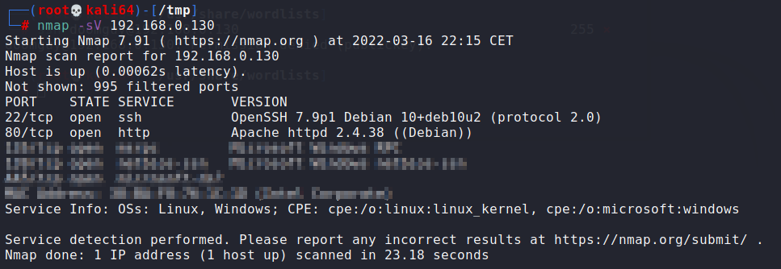

## Service fingerprinting

Most commonly, fingerprinting is done to determine operating system and application versions. Fingerprinting by itself is not usually detrimental to the target. However, the information gathered through fingerprinting often enables the attacker to discover existing weaknesses and vulnerabilities in the target. For example, if the target is running a vulnerable version of a software application, the fingerprinting process can reveal the vulnerability. Fingerprinting can be done passively as well as actively.

Active fingerprinting involves sending TCP or ICMP packets and analyzing the response from the target, the packet headers contain information that causes different operating systems to respond differently. The attacker should be aware that active fingerpring brings the risk of easy detection.

To avoid detection, an attacker can rely on passive fingerprinting techniques that are stealthy and do not involve sending any packets to the target system, instead they rely on scanning the network to detect patterns in the usual network traffic, since different systems have different TCP/IP implementations. If your target is running publicly available services, passive fingerprinting may be a good way to start off your fingerprinting. Drawbacks of passive fingerprinting are that it is usually less accurate than a targeted active fingerprinting session and it relies on an existing traffic stream to which you have access. It can also take much longer depending on how high the activity level of the target system is.

One of the other most used features of Nmap is remote OS detection, there are different ways you can accomplish this. The -O option enables simple OS detection. Alternatively, Nmap also has a feature called the Nmap Scripting Engine(NSE), using the option -A will not only find the OS type but also run NSE scripts for version detection. Aditionally, using the options -sV and -sC the attacker can find the version of the service running on that port and also based on default NSE scripts any possible vulnerabilities regarding those services.

```
nmap -sV <ip>
```

Let's check another example from one of our labs:



We can see the version of the services running on port 22 and 80. This gives us crucial information about the services running on the host. We can then check if the services running on those particular versions are vulnerable to known vulnerabilities. This information might be crucial for the exploitation phase.