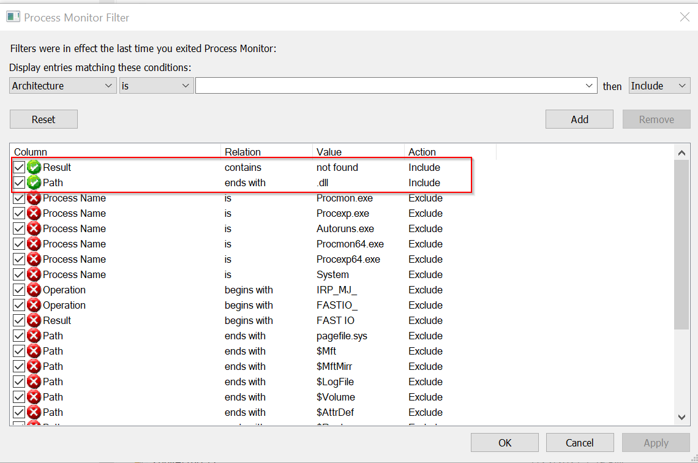

##Running Local Services
On an operating system many processes are running in the background as a service or a scheduled task. These services and tasks often require higher privileges to execute what they are designed for.

###Scheduled tasks/jobs
On a Linux system you may want to look into ‘cron’ jobs where on a Windows system you will be looking into ‘scheduled tasks’. These jobs/tasks can be default tasks (created during installation of the OS) or custom tasks. Usually you want to look into the custom tasks to hunt for any flaws in the design.

#####Misconfigurations
Check if you have the permission to simply change the scheduled task or cron job.
Check the permissions of the folder that contains the executable or script, but also the permissions of folders that it may be using (analyze the script for that). If the script, is running by a higher privileged user, and it is using a directory where you have full control, you may want to look into creating 'symlinks'.

#####Vulnerabilities
Scheduled tasks or cron jobs may also run executables that have vulnerabilities that can be exploited. A typical vulnerability that you may want to investigate on a Windows system is DLL hijacking (see also the "Local Services" section here below). If the executable is vulnerable to dll hijacking and loading dll’s from a location where you have write access, then you can create your own payload in a dll, which will be executed when the tasks runs. One of the misconfigurations to look at is the PATH environment variable as it will show you where the application might be looking for DLL’s that need to be loaded.

```
c:\> PATH
PowerShell:$ENV:PATH
```

###Local Services
During the information gathering you may have found services that are exposed externally (like SSH, FTP, HTTP, OracleDB and so on), but a system also has a lot of services that are running locally which are not exposed externally. On a windows system you will be interested in all services that are running as SYSTEM (see screensot below) or if you’re lucky, maybe you’ll find a system that is running with a domain account. Usually, the more interesting services are the non-Microsoft services as these are high likely installed after the installation of the OS.

```
c:\> Services.msc
Powershell: Get-WmiObject win32_service | select Name, DisplayName, State, PathName
```

Using <a href="https://docs.microsoft.com/en-us/sysinternals/downloads/procmon"target="_blank">procmon</a> you can identify services that are searching for dll’s that are trying to load dll’s that are not in their install directory; If you can find a location with a writable path you can create your own dll that spawns a shell with the privileges of the service. More information on DLL hijacking can be found <a href="https://itm4n.github.io/windows-dll-hijacking-clarified/" target="_blank">here</a>

The screenshot below shows the Procmon filter that you need to setup to capture applications that are searching for DLL's


Note: procmon for Linux can be found <a href="https://github.com/Sysinternals/Procmon-for-Linux"target="_blank">here</a>

##Permissions, services & users
Both Linux systems and Windows systems have the concept of user and group permissions. More information on these concepts can be found <a href="https://linuxfoundation.org/blog/classic-sysadmin-understanding-linux-file-permissions/" target="_blank">here</a> (Linux) and <a href="https://docs.microsoft.com/en-us/archive/msdn-magazine/2008/november/access-control-understanding-windows-file-and-registry-permissions" target="_blank">here</a> (Windows). When you were able to exploit a vulnerability and have remote or local command execution on the system, you're actions/commands may be limited on the system and you may need to escalate your privileges.
####Privilege escalation
#####Linux

######Kernel Exploits
Kernel exploits are pieces of malicious code that leverage kernel vulnerabilities in order to elevated permissions. Successful kernel exploits typically give attackers super user access to target systems as. Escalating to root can be as simple as downloading a kernel exploit to the target file system, compiling the exploit, and then executing it. <a href="https://github.com/dirtycow/dirtycow.github.io/wiki/PoCs" target="_blank">Dirtycow</a> is one of the famous kernel exploits.

######Services running as root
system administrators may configure web servers, mail servers, database servers etc as root as it is easier to get things working. Please note that there could also be services which run locally and are not exposed publicly which can also be exploited.
Services running as root can be found using the following command.
```
ps -aux | grep root
```
Note to further investigate running services you can use <a href="https://github.com/Sysinternals/Procmon-for-Linux"target="_blank">procmon for Linux</a>.

######SUID bit
SUID which stands for set user ID, and is a Linux feature that allows users to execute a file with the permissions of a specified user. For example, the Linux passwd command requires root permissions. By marking 'passwd' as SUID with the owner as root, it executes with root privileges anytime a low privilege user executes the program in order to change his password.


We can search for executables which have the SUID bit set:


In the screenshot above we see that nmap has its SUID bit set. This means that nmap is running with root privileges when executed by an other user. Nmap used to have an interactive mode which allowed you to immediatly execute OS commands. In the newer versions this option is removed but we can still exploit the vulnerability as shown below:


######Sudo rights
system administrators may allow users to run a few commands through <a href="https://nl.wikipedia.org/wiki/Sudo"target="_blank">Sudo</a>.
A classic example of assigning SUDO rights to the "find" command, so that a specific user can search in log files on the system. An admin might be unaware that the "find" command contains parameters that allow command execution which allows an attacker to gain command execution with root privilege.
We can list the sudo rights for the user as follows:

In the screenshot above we see that the user john has sudo rights on the "find" executable.

This can be exploited as follows:


#####Windows
######Services running as SYSTEM
On windows services can run with the SYSTEM account or a specified account.
The proper way is to run services according to the least privilege principle. Therefore administrators should create a user that has only the necessary privileges to run the task the service was designed for. If the service only needs to perform tasks on the local system, an admin should create a local user. If the use user needs to interact with other sytstems, the administrator will high likely need to configure a domain user. Often, system administrators use the option to run a service as SYSTEM ('local system account'), which is often a (too) high privileged account.


An attacker should try to identify directories where he/she has write access and where services, or one of its executable components (like DLL's), are installed in. Having write access on a service or on one of its executable components may allows you to replace or inject executables (exe's and DlL's) and obtain command execution in the context of the running service. Once you can obtain a shell as SYSTEM (or another high privileged user), you may want to look for credentials of domain accounts (for example in memory, via keyboard logging and so on) for lateral movement.


######NTFS permissions
Again, just as it is the easiest way to accomplish a task, system administrators may give the Active Directory group 'Everyone' write permissions on certain folders on the system. If the such folders contain executables that are ran by higher privileged accounts, then these executables can be replaced with your malicious ones in order to obtain higher privileged command execution. please note that NTFS permissions are also applicable for the windows registry hives.
NTFS permissions can be investigated with <a href="https://docs.microsoft.com/en-us/sysinternals/downloads/accessenum"target="_blank">Sysinternals AccessEnum</a>.

##Sensitive files & interesting locations
Linux and Windows both have their system specific files that are interesting and also some common files like the host file (where you can find Domain Name Resolution records) but often, the most interesting files are the ones related to the applications (see here below).
###Application Credentials
Web applications and thick client applications may use a specific account to connect to a file server or a backend database. These accounts are usually defined in config files. In most case you have read access to these configuration files and if you're lucky the credentials are contained in the file in clear text.
If the credentials are encrypted then still at a certain point in time the application needs to decrypt the credentials and often you'll find those credentials in memory. On Linux, one way to dump memory is using procdump (<a href="https://embracethered.com/blog/posts/2021/linux-procdump/" target="_blank">see here</a>). On windows systems <a href="https://docs.microsoft.com/nl-nl/sysinternals/downloads/procdump" target="_blank">Procdump</a> can be used as well, but memory can also be dumped with windows task manager. Another great tool for this task is <a href="https://processhacker.sourceforge.io/" target="_blank">ProcessHacker</a>
If the tool is a DOTNET application, then the source code can easily decompiled as dotnet applications are compiled in an intermediate language. By analyzing the decompiled code, one can find out how to decrypt the credentials from a the configuration file.

###Backups
Some times system administrators carelessly leave backup files behind on the system. Backups can be just Tar'ed or zip'ed directories or can be backup files from databases (Look for \*.bak or \*.sql)

###DSN
Sometimes, applications are created with MSaccess or a front end that uses an MS access database. If the MSaccess database has linked tables to another database (like an Oracle DB or an MSSQL DB) via ODBC, then the credentials for the conection to the backend DB may be stored in the MSysObjects table of MSaccess.

###Tools
System administrators often use tools like "mgremote" and "winscp" to connect to other systems. These tools have the option to save the credentials. Many tools exist to reveal those credentials (<a href="https://github.com/rudytruyens/PasswordPeeper" target="_blank">Example</a>).
Sometimes developers create custom tools to test there database connections or autmate user creation etc. these tools (if found) can often be exploited.

###Inercept network traffic
Once on the system, another interesting location to look for credentials is the network traffic. Wireshark is one of the most commonly used tools to capture network traffic and also has <a href="https://www.wireshark.org/docs/wsdg_html_chunked/ChToolsPortableApps.html" target="_blank">portable</a> version.

##Windows NTLMV2 hash
If a server requests for the user to authenticate, Windows will try to do so using the user's credentials. This way the user doesn't need to provide his/her credentials for each individual server. The downside is that any server can request authentication and Windows will happily comply. The NTLMV2 hash that windows presents for the authentication can be captured and therafter be bruteforced. 
Well known examples are Office documents that contain links to external content, that when pointed to a network share, can result in disclosing NTLMV2 hashes. However, the more interesting case are those where a service or a server tries to authenticate to a share on the network. This is sometimes encountered when a backend database server like SQL server generates a report or export data on a file share. In that case the NTLMv2 hash, of the account under which the SQL server or one of its services is running, can be captured.
A nice tool to capture NTLMV2 hashes is <a href="https://github.com/lgandx/Responder" target="_blank">Responder</a>
Instead of trying to brute force the hash, one can also pass the hash to authenticate to another server.
You need to use a tool that will perform the NTLM authentication using that hash. Impacket's <a href="https://github.com/SecureAuthCorp/impacket/blob/master/examples/psexec.py" target="_blank">PSexec</a> and the powershell script <a href="https://github.com/Kevin-Robertson/Invoke-TheHash" target="_blank">Invoke-TheHash</a> are examples of tools that can be used to exploit the captured NTLMV2 hash.


