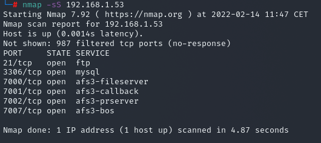

## Port Scanning

Although common services have assigned port numbers, services and applications can run on arbitrary ports. Additionally, port scanning is complicated by the potential for any machine to have up to 65535 possible UDP or TCP services. The goal of port scanning is often broader than identifying open ports, but also give the adversary information concerning the firewall configuration.

Depending upon the method of scanning that is used, the process can be stealthy or more obtrusive, the latter being more easily detectable due to the volume of packets involved, anomalous packet traits, or system logging. Typical port scanning activity involves sending probes to a range of ports and observing the responses. There are four port statuses that this type of attack aims to identify: open, closed, filtered, and unfiltered. For strategic purposes it is useful for an adversary to distinguish between an open port that is protected by a filter vs. a closed port that is not protected by a filter. Making these fine grained distinctions is requires certain scan types. Collecting this type of information tells the adversary which ports can be attacked directly, which must be attacked with filter evasion techniques like fragmentation, source port scans, and which ports are unprotected (i.e. not firewalled) but aren't hosting a network service. An adversary often combines various techniques in order to gain a more complete picture of the firewall filtering mechanisms in place for a host.

The most popular linux tool for port-scanning is nmap, which have the ability to send TCP, UDP or ICMP packets to determine if a port is open based on the host's response. Nmap also has other capabilities such as OS decetion, service and version detection and doing DNS queries and subdomain search only to name a few. Nmap -help can give you a simple overview on how powerful this tool can be and the different ways you could use it. For example we could use -sT for a TCP connect port scan or take a less intrusive approach with -sS for a TCP SYN port scan.

```
nmap -sS <ip>
```

Let's see an example from one of our labs:



From this simple scan we can learn a lot about our host, we can see, for example, ftp and mysql services running on open ports. This information can be used during the exploitation phase. There are many other tools that can be used to perform port scanning such as netcat:

```
nc -zv <ip> <port range> 2>&1 | grep succeeded
```

Another important part of the port scanning process is understanding firewall rules implemented and try to identify possible misconfigurations in firewall that would allow the attacker ways to bypass it. There are Nmap options such as -SF (FIN) and -sX (XMAS) that will send packets with only certain flags set to test if the firewall is responding accordingly. Even more problematic, identifying the lack of a firewall represents an open door to the attacker for easy access to the network.

