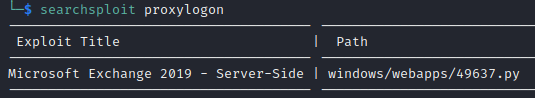
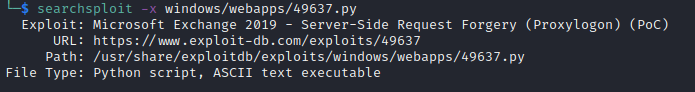
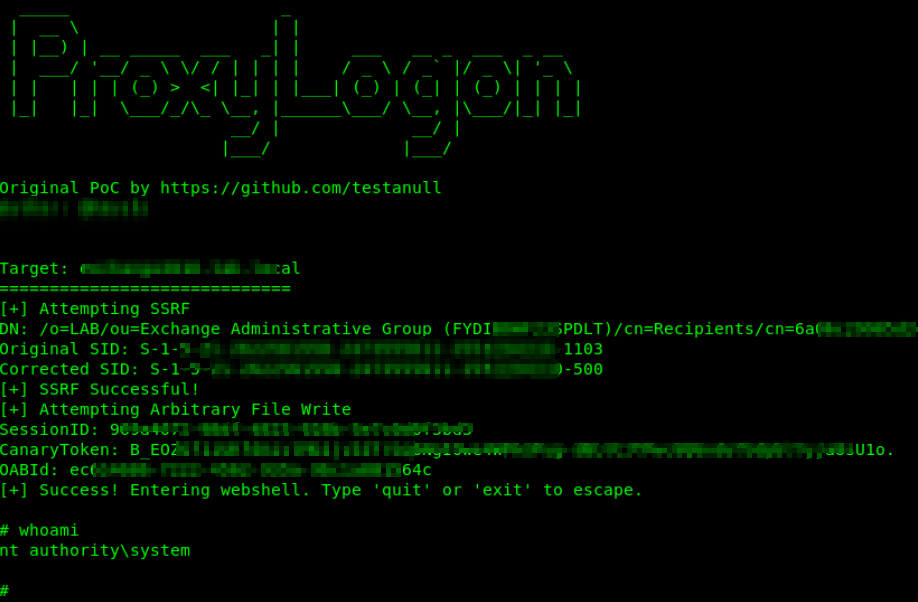

## ExploitDB

The Exploit Database is a CVE compliant archive of public exploits and corresponding vulnerable software, developed for use by penetration testers and vulnerability researchers. The Exploit Database is maintained by Offensive Security. The Exploit DB is a repository for exploits and proof-of-concepts rather than advisories, making it a valuable resource for those who need actionable data right away.

KaliOS also provides **_searchsploit_** tool that lookups a local copy of ExploitDB for public vulnerabilities: `searchsploit <keywords/CVEs>/version/service>`

Let's see how this valuable database can be used?

Publicly disclosed 'Microsoft Exchange Server ProxyLogon' attack contains two vulnerabilities to make it efficient weapon on targets.

- CVE-2021-26855 - CVSS 9.1: a Server-Side Request Forgery (SSRF) vulnerability leading to crafted HTTP requests being sent by unauthenticated attackers. Servers need to be able to accept untrusted connections over port 443 for the bug to be triggered.

- CVE-2021-27065 - CVSS 7.8: a post-authentication arbitrary file write vulnerability to write to paths.

As a result, an unauthenticated attacker can execute arbitrary commands on Microsoft Exchange Server through an only opened 443 port!

**Searching for known finding by its name as 'proxylogon' via ExploitDB**

**Searching for known finding by its name as 'proxylogon' via 'searchsploit'**

**Details of 'proxylogon' exploit via 'searchsploit'**

**Publicly published ProxyLogon Proof of Concept (PoC) Script**

**Weaponization of 'ProxyLogon' allowing to execute any commands on the server**

Similarly, searching for SQL injection vulnerability is using ExploitDB and searchsploit.

**Searching for known finding by its name as 'Casdoor 1.13.0 SQL Injection' via 'searchsploit'**

**Searching for known finding by its name as 'Casdoor 1.13.0 SQL Injection' via ExploitDB**

**Weaponization of 'SQL Injection' allowing to execute any SQL queries on the server**

