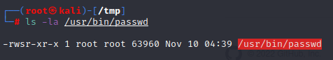
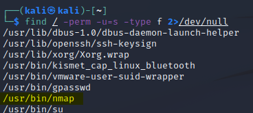
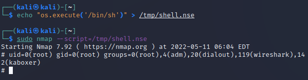
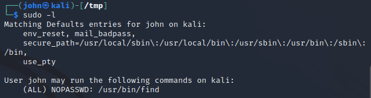
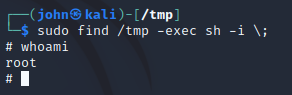

## Privilege escalation

### Linux

#### Kernel Exploits
Kernel exploits are pieces of malicious code that leverage kernel vulnerabilities in order to elevated permissions. Successful kernel exploits typically give attackers super user access to target systems as. Escalating to root can be as simple as downloading a kernel exploit to the target file system, compiling the exploit, and then executing it. <a href="https://github.com/dirtycow/dirtycow.github.io/wiki/PoCs" target="_blank">Dirtycow</a> is one of the famous kernel exploits.

#### Services running as root
system administrators may configure web servers, mail servers, database servers etc as root as it is easier to get things working. Please note that there could also be services which run locally and are not exposed publicly which can also be exploited.
Services running as root can be found using the following command.
```
ps -aux | grep root
```
Note to further investigate running services you can use <a href="https://github.com/Sysinternals/Procmon-for-Linux" target="_blank">procmon for Linux</a>.

#### SUID bit
SUID which stands for set user ID, and is a Linux feature that allows users to execute a file with the permissions of a specified user. For example, the Linux passwd command requires root permissions. By marking 'passwd' as SUID with the owner as root, it executes with root privileges anytime a low privilege user executes the program in order to change his password.



We can search for executables which have the SUID bit set:



In the screenshot above we see that nmap has its SUID bit set. This means that nmap is running with root privileges when executed by an other user. Nmap used to have an interactive mode which allowed you to immediatly execute OS commands. In the newer versions this option is removed but we can still exploit the vulnerability as shown below:



#### Sudo rights
system administrators may allow users to run a few commands through <a href="https://nl.wikipedia.org/wiki/Sudo" target="_blank">Sudo</a>.
A classic example of assigning SUDO rights to the "find" command, so that a specific user can search in log files on the system. An admin might be unaware that the "find" command contains parameters that allow command execution which allows an attacker to gain command execution with root privilege.
We can list the sudo rights for the user as follows:



In the screenshot above we see that the user john has sudo rights on the "find" executable.

This can be exploited as follows:


