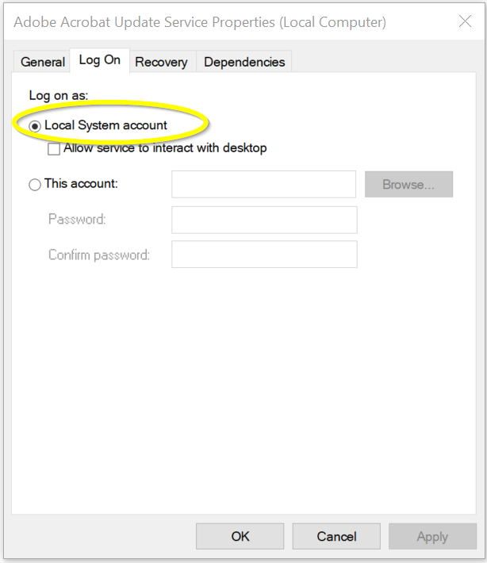

## Privilege escalation

### Windows

#### Services running as SYSTEM
On windows services can run with the SYSTEM account or a specified account.
The proper way is to run services according to the least privilege principle. Therefore administrators should create a user that has only the necessary privileges to run the task the service was designed for. If the service only needs to perform tasks on the local system, an admin should create a local user. If the use user needs to interact with other sytstems, the administrator will high likely need to configure a domain user. Often, system administrators use the option to run a service as SYSTEM ('local system account'), which is often a (too) high privileged account.

An attacker should try to identify directories where he/she has write access and where services, or one of its executable components (like DLL's), are installed in. Having write access on a service or on one of its executable components may allows you to replace or inject executables (exe's and DlL's) and obtain command execution in the context of the running service. Once you can obtain a shell as SYSTEM (or another high privileged user), you may want to look for credentials of domain accounts (for example in memory, via keyboard logging and so on) for lateral movement.

#### NTFS permissions
Again, just as it is the easiest way to accomplish a task, system administrators may give the Active Directory group 'Everyone' write permissions on certain folders on the system. If the such folders contain executables that are ran by higher privileged accounts, then these executables can be replaced with your malicious ones in order to obtain higher privileged command execution. please note that NTFS permissions are also applicable for the windows registry hives.
NTFS permissions can be investigated with <a href="https://docs.microsoft.com/en-us/sysinternals/downloads/accessenum" target="_blank">Sysinternals AccessEnum</a>.

#### Sensitive files & interesting locations
Linux and Windows both have their system specific files that are interesting and also some common files like the host file (where you can find Domain Name Resolution records) but often, the most interesting files are the ones related to the applications (see here below).
###Application Credentials
Web applications and thick client applications may use a specific account to connect to a file server or a backend database. These accounts are usually defined in config files. In most case you have read access to these configuration files and if you're lucky the credentials are contained in the file in clear text.
If the credentials are encrypted then still at a certain point in time the application needs to decrypt the credentials and often you'll find those credentials in memory. On Linux, one way to dump memory is using procdump (<a href="https://embracethered.com/blog/posts/2021/linux-procdump/" target="_blank">see here</a>). On windows systems <a href="https://docs.microsoft.com/nl-nl/sysinternals/downloads/procdump" target="_blank">Procdump</a> can be used as well, but memory can also be dumped with windows task manager. Another great tool for this task is <a href="https://processhacker.sourceforge.io/" target="_blank">ProcessHacker</a>
If the tool is a DOTNET application, then the source code can easily decompiled as dotnet applications are compiled in an intermediate language. By analyzing the decompiled code, one can find out how to decrypt the credentials from a the configuration file.

#### Backups
Some times system administrators carelessly leave backup files behind on the system. Backups can be just Tar'ed or zip'ed directories or can be backup files from databases (Look for \*.bak or \*.sql)

#### DSN
Sometimes, applications are created with MSaccess or a front end that uses an MS access database. If the MSaccess database has linked tables to another database (like an Oracle DB or an MSSQL DB) via ODBC, then the credentials for the conection to the backend DB may be stored in the MSysObjects table of MSaccess.

#### Tools
System administrators often use tools like "mgremote" and "winscp" to connect to other systems. These tools have the option to save the credentials. Many tools exist to reveal those credentials (<a href="https://github.com/rudytruyens/PasswordPeeper" target="_blank">Example</a>).
Sometimes developers create custom tools to test there database connections or autmate user creation etc. these tools (if found) can often be exploited.

#### Inercept network traffic
Once on the system, another interesting location to look for credentials is the network traffic. Wireshark is one of the most commonly used tools to capture network traffic and also has <a href="https://www.wireshark.org/docs/wsdg_html_chunked/ChToolsPortableApps.html" target="_blank">portable</a> version.

#### Windows NTLMV2 hash
If a server requests for the user to authenticate, Windows will try to do so using the user's credentials. This way the user doesn't need to provide his/her credentials for each individual server. The downside is that any server can request authentication and Windows will happily comply. The NTLMV2 hash that windows presents for the authentication can be captured and therafter be bruteforced. 
Well known examples are Office documents that contain links to external content, that when pointed to a network share, can result in disclosing NTLMV2 hashes. However, the more interesting case are those where a service or a server tries to authenticate to a share on the network. This is sometimes encountered when a backend database server like SQL server generates a report or export data on a file share. In that case the NTLMv2 hash, of the account under which the SQL server or one of its services is running, can be captured.
A nice tool to capture NTLMV2 hashes is <a href="https://github.com/lgandx/Responder" target="_blank">Responder</a>
Instead of trying to brute force the hash, one can also pass the hash to authenticate to another server.
You need to use a tool that will perform the NTLM authentication using that hash. Impacket's <a href="https://github.com/SecureAuthCorp/impacket/blob/master/examples/psexec.py" target="_blank">PSexec</a> and the powershell script <a href="https://github.com/Kevin-Robertson/Invoke-TheHash" target="_blank">Invoke-TheHash</a> are examples of tools that can be used to exploit the captured NTLMV2 hash.

