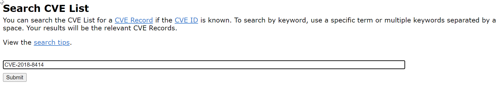
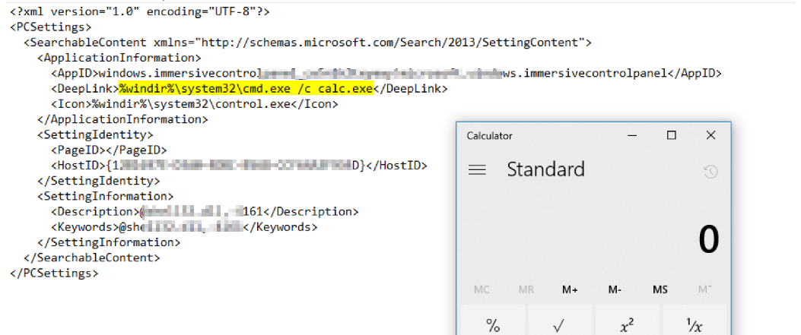
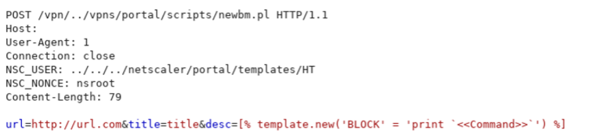
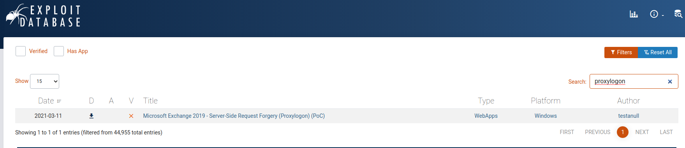
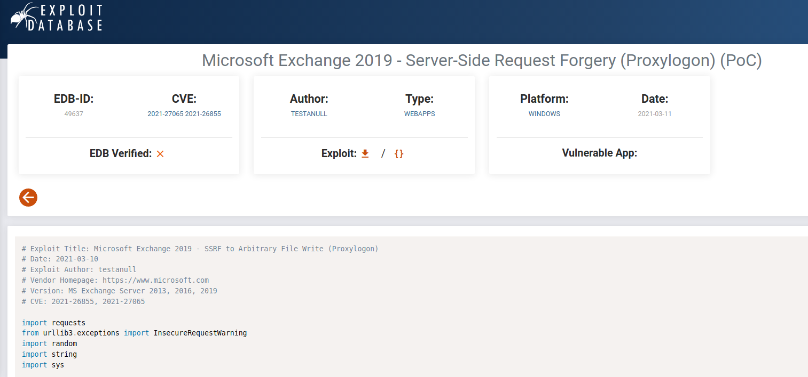
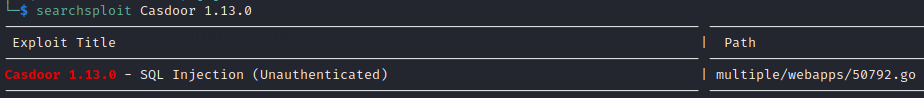
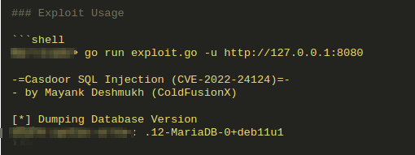

# Weaponization

The weaponization is intended to develop a method of exploiting a discovered weakness. This may include development of custom malware, making use of misconfigurations, identifying known vulnerabilities, crafting a phishing email, typically PDF or Microsoft Office documents can serve as weaponized deliverable for malicious payload, typically by means of an automated tool (weaponizer). Depending on the target and the purpose of the attacker, an attacker can exploit new, undetected vulnerabilities (also known as the zero-day exploits) or it can focus on a combination of different vulnerabilities.

## Application Layers Weaponization

The vulnerabilities detected at application layer frequently rely on complex user inputs. The variety of possible exploiting payloads of a single vulnerability make intrusion detection signature definition a arduous task. This layer is where the user interactions occur, being accessible via standard communication protocols by clients and consumers components and they are, thus, the most exposed to the outside world and the most accessible.
Each of these protocols was designed to provide the function it was built to do and with a lesser focus on security. Malicious users and hackers can compromise both the application that utilizes these protocols and the network protocols themselves.
Regularly targeted application layer services:

- File Transfer Protocol (FTP)
- Telnet
- Secure Shell (SSH)
- Simple Mail Transfer Protocol (SMTP)
- Domain Name System (DNS)
- Hypertext Transfer Protocol (HTTP)
- Server Message Block (SMB)

How the services can be used by a malicious/weaponized software?

### File Transfer Protocol (FTP)

FTP is a communication protocol used for transferring files between computer systems.  
|Exploit|Description|
|--|---|
|Anonymous access|A misconfigured FTP service can allow an anonymous user access to sensitive information. Anonymous access can be checked by running the following FTP command and providing **_anonymous:password_** credentials when requested: <pre>ftp &lt;SERVER_[HOSTNAME\|IPADDRESS]&gt;</pre> The same can be achieved using the Metasploit FTP Anonymous Auxiliary Module[^metasploit_ftp]|
|Brute force attacks | FTP services are not protected against brute-force attacks by default. This verification can be done using the Metasploit FTP Login Auxiliary Module[^metasploit_ftp]|
|MitM Sniffing/Spoofing| FTP protocol is unencrypted, turning it vulnerable to Man-in-the-Middle (MitM) attacks.|
|Service specific vulnerabilities| Based on the Service Fingerprinting results, it is possible to determine the software and version running the service. The information can be looked up at ExploitDB and CVE databases for public exploits.|

### Telnet

Telnet is an application protocol built for providing a command-line interpreter normally used for remote server management.

|Exploit|Description|
|---|---|
|User enumeration|Telnet servers responds differently whether the username is valid or invalid. The telnet command **_vrfy &lt;USERNAME&gt;_** will return 550 error if the username is incorrect. User enumeration can be also done using Metasploit Telnet Login auxiliary module[^metasploit_telnet].|
|Brute force attacks|Authentication brute force attacks can be done using Metasploit Telnet Login auxiliary module[^metasploit_telnet].|
|MitM Sniffing/Spoofing| Telnet protocol is unencrypted, turning it vulnerable to Man-in-the-Middle (MitM) attacks.|
|Service specific vulnerabilities| Based on the Service Fingerprinting results, it is possible to determine the software and version running the service. The information can be looked up at ExploitDB and CVE databases for public exploits.|

### Secure Shell (SSH)

SSH is a network protocol built for providing a command-line interpreter normally used for secure remote server management and secure file transfer.

|Exploit|Description|
|---|---|
|Brute force attacks| Authentication brute force attacks can be done using Metasploit SSH Login auxiliary module[^metasploit_ssh].|
|User enumeration|The response to specially crafted packets sent to vulnerable servers may indicate if the username is valid. The verification can be done using the Metasploit SSH Enumusers auxiliary module[^metasploit_ssh_enumusers].|
|Service specific vulnerabilities| Based on the Service Fingerprinting results, it is possible to determine the software and version running the service. The information can be looked up at ExploitDB and CVE websites for public exploits.|

### Simple Mail Transfer Protocol (SMTP)

SMTP is a communication protocol used for email transmission.
|Exploit|Description|
|---|---|
|Open relay| It is a SMTP server misconfiguration that allows anyone on the internet or in the same network to send any email through it. The sender and receiver can be forged using open relay servers. Open relay can be verified with Metasploit SMTP Relay auxiliary module [^metasploit_smtp_relay].|
|User enumeration| The verification can be done using the Metasploit SSH Enumusers auxiliary module[^metasploit_smtp].|
|MitM Sniffing/Spoofing| Telnet protocol is unencrypted, turning it vulnerable to Man-in-the-Middle (MitM) attacks.|
|Service specific vulnerabilities| Based on the Service Fingerprinting results, it is possible to determine the software and version running the service. The information can be looked up at ExploitDB and CVE databases for public exploits.|

### Domain Name System (DNS)

DNS is a naming system used to identities computers reachable through the internet or LANs.
|Exploit|Description|
|---|---|
|Record enumeration| DNS record enumeration can be achieved by different means: Zone Transfer, Brute forcing, reverse lookups, and others. Different tools can be used for record enumeration: Fierce DNS[^fierce_dns], Metasploit DNS Enum auxiliary module [^metasploit_dns_enum], GoBuster[^gobuster], Amass[^amass], etc.|
|Service specific vulnerabilities| Based on the Service Fingerprinting results, it is possible to determine the software and version running the service. The information can be looked up at ExploitDB and CVE databases for public exploits.|

### Hypertext Transfer Protocol (HTTP)

HTTP is an application-layer protocol for transmitting hypermedia documents, such as HTML.

|Exploit|Description|
|---|---|
|Application related attacks| HTTP is the industry standard used for Web-Applications and APIs communication and thus, most of targeted attacks will use the HTTP protocol. HTTP Interception proxy tools such as Portswigger Burpsuite[^burpsuite] and OWASP ZAP[^owasp_zap] are used for testing Web Applications and APIs.|
|MitM Sniffing/Spoofing| HTTP protocol is unencrypted, turning it vulnerable to Man-in-the-Middle (MitM) attacks.|
|Web server specific vulnerabilities|Based on the Service Fingerprinting results, it is possible to determine the software and version running the service. The information can be looked up at ExploitDB and CVE databases for public exploits.|

### Server Message Block (SMB)

SMB is a network sharing protocol developed by Microsoft, used for sharing to access files, printers, serial ports, and other resources between different systems.

|Exploit|Description |
|---| --- |
|Shares enumeration|Shares available in a server may be listed with or without authentication. The command <pre>smbclient –L <SERVER_HOSTNAME\|IPADDRESS></pre> can be used to identify interesting open network shares. The same can be achieved with Metasploit SMB Enum Shares auxiliary module[^metasploit_smb].|
|Unauthenticated access|Misconfigured SMB shares may allow unauthenticated access to sensitive data. Shares can be accessed by using <pre>smbclient '\\\\<SERVER_HOSTNAME\|IP>\<SHARE>'</pre>|
|Users enumeration|Valid users can be enumerated with Metasploit SMB Enum Users auxiliary module[^metasploit_smb]|
|Login Brute force|Login brute force can be done via Metasploit SMB Login auxiliary module[^metasploit_smb]|  
|Protocol specific vulnerabilities|Based on the Service Fingerprinting results, it is possible to determine the software and version running the service. The information can be looked up at ExploitDB and CVE databases for public exploits.|

## Misconfiguration

Misconfiguration can happen at any level of an application stack, including the platform, web server, application server, database, framework, and custom code. Developers and system administrators need to work together to ensure that the entire stack is configured properly. Automated scanners are useful for detecting missing patches, misconfigurations, use of default accounts, unnecessary services.

The frequent misconfigurations:

- Debugging enabled

- Incorrect permissions

- Default credentials

- Default installation files

- Cloud misconfiguration

- Network and security devices misconfiguration

How the services can be used by a malicious/weaponized software?

### Debugging enabled

App server configuration allows stack traces to be returned to users, potentially exposing underlying flaws. Attackers seek the extra information error messages provide.

### Incorrect permissions

Developers/admins forget to properly set permissions on publicly exposed directories, admin consoles or dashboards. Therefore, attackers can access unauthorized files. This might be confused with the Broken Access Control vulnerability, but the root cause happens to be a misconfiguration issue, before even reaching any web application feature or other services which interact with the permissions.

### Default credentials

The app server admin console is automatically installed and default accounts are not changed. Attacker discovers the standard admin pages are on your server, logs in with default passwords, and takes over.

### Default installation files

The app server comes with sample applications that are not removed from your production server. The sample applications have well-known security flaws attackers can use to compromise your server.

### Cloud misconfiguration

Cloud misconfiguration can be defined as any errors, glitches or gaps in your cloud environment that can leave you exposed to risk. The main issues are:

- Insufficient access controls and permissive network access

- Insufficient access controls on resources:

- Access control misconfigurations can expose sensitive data or leave valuable files at risk of being stolen. Allowing attackers to read data from your databases or retrieve files from cloud storage puts your company at risk of corporate espionage, exposes users’ personal information, and enables malicious actors to delete critical data. If attackers gain access to your network or servers, they can potentially disrupt your services. This disruption can include ransomware attacks by encrypting files or servers, delete resources or even use servers to send spam or mine bitcoins illicitly.

- Network and security devices misconfiguration

- A single change to a network device can have far-reaching effects on businesses; creating security holes for cybercriminals to exploit, preventing you from passing crucial regulatory and compliance audits, and causing costly outages which can bring your business to a standstill.

- Exposing sensitive services and servers to the public

- Leftover networking rules cause unexpected behaviour

## CVE Search

CVE (Common Vulnerabilities and Exposures) is a standard for identifying publicly disclosed information security vulnerabilities and exposures. Attackers frequently use it as a starting point for planning an attack. For example, in the RiskSense report, which examines 22 years of CVE data on nearly 3,000 vulnerabilities against Adobe products, weaponized vulnerabilities against the Adobe family of products rose 139% between 2017 and 2018. Another example, in July of 2018, Bleeping Computer reported the weaponization of a shortcut vulnerability in Microsoft Windows SetttingContent-ms files to execute code (in this case a RAT, or remote access Trojan) on a Windows 10 OS.

**Searching for known finding by its CVE ID of CVE-2018-8414 belong to 'Microsoft Windows SetttingContent-ms**

**Search result of CVE-2018-8414 belong to 'Microsoft Windows SetttingContent-ms**

**Weaponization of 'Microsoft Windows SetttingContent-ms' extension allow to execute any commands**  

Similarly, Citrix ADC and Gateway allowed directory traversal vulnerability (CVE-2019-19781) that leads attacker to gain remote code execution on the server. Citrix appliance does not sanitize and writes to an XML file that is created on the local file system. While writing to an XML file does not directly have to lead to remote code execution injecting Perl Template Toolkit instructions and parsing the file as a template does lead to code execution.

**Search result for known finding by its name 'Citrix ADC and Gateway Directory Traversal**

**Weaponization of 'Citrix ADC and Gateway Directory Traversal' allowing to execute any commands on the server**

**Execution OS commands as a result of weaponizing the publicly disclosed vulnerability**  

Official CVE Publications can be accessed via the following sources:

- NIST (<https://nvd.nist.gov/vuln/search>)

- CVE Mitre (<https://cve.mitre.org/>)

- CVE (<https://www.cve.org/>)

Other pages can be useful for searching CVEs

- CVEDetails (<https://www.cvedetails.com/>)

- CIRCL CVE Search (<https://cve.circl.lu/>)

- snyk Vulnerability DB Open Source (<https://security.snyk.io/>)

What infra/dev people should do?

This gap between availability of exploit versus availability of patch for the vulnerability being exploited creates a window of opportunity that organizations should be concerned with.  

- Software/patch management

- Inventory Your Systems: Any patch management procedure must start with a thorough inventory of all software and hardware in your environment. The inventory should include all servers, workstations, storage devices, routers, and so on.

- Consolidate Software Versions: The higher the risk of exposure, the more versions of a piece of software you use. It also generates a lot of paperwork. Pick one version of Windows, Linux, or MacOS and keep it patched.

- Assign Risk Levels to Your Systems: IT systems have different priorities and risk levels. A server connected to the Internet poses a greater danger than one connected to a secured network. Patches are also prioritized differently. A crucial patch for the ESXi host takes precedence over a routine Windows Server cumulative update. An emergency security patch (for example, Petya/WannaCry/Windows RPC RCE) is even more important and should be applied out of band.

- Define the patch release cycle: Patches should be tested in a non-production environment (test lab, development) to ensure that they do not break anything. There are numerous scenarios in which a patch may create third-party application difficulties or system instability. The non-production environment should reflect the production environment. Commonly, first patch and test in 'test environment', then 'pre-production environment', then 'production' and finally 'disaster recovery' environment.

- Test Patches Before Applying Everywhere: Every environment is distinct. With certain configurations, a patch could create issues or even bring down machines. Apply the patch to a small subset of your systems to ensure that there are no serious issues.

- Backups of production systems: Backups should be performed on a regular basis, and any problems should be addressed immediately. Furthermore, backups are frequently managed by separate teams, and system owners rarely have access to backup systems.

- Apply Patches: You're ready to deploy the changes to production systems once you have tested and validated everything. This is typically done outside of business hours (on weekends) to avoid downtime and to ensure that everything went smoothly. When security flaws are discovered in custom code, they should be added to the development team's backlog and handled as seriously as vendor patches. In your own applications, do not leave the door open for an attack. Quickly patch vulnerabilities and update your production software.

- Verify and Report the Systems Pre- and Post- Patching: Some servers may fail to apply updates when they are applied to hundreds of servers using patching tools. In some situations, the server will require direct intervention, such as a reboot. Having a script that checks the server status is a typical practice (e.g., pending reboot).

- Continuous vulnerability management: It is the process of finding, prioritizing, documenting, and remediating weak areas in an IT environment is known as continuous vulnerability management. Because sensitive data is growing at an unprecedented rate and assaults are becoming more frequent and sophisticated, vulnerability management must be ongoing. The Center for Internet Security (CIS) provides Critical Security Controls to help organizations improve cybersecurity. Control 7 addresses continuous vulnerability management with the following topic.

- Establish and maintain a vulnerability management process

- Establish and maintain a remediation process

- Perform automated operating system patch management

- Perform automated application patch management

- Perform automated vulnerability scans of internal enterprise assets

- Perform automated vulnerability scans of externally exposed enterprise assets

- Remediate detected vulnerabilities  

## ExploitDB

The Exploit Database is a CVE compliant archive of public exploits and corresponding vulnerable software, developed for use by penetration testers and vulnerability researchers. The Exploit Database is maintained by Offensive Security. The Exploit DB is a repository for exploits and proof-of-concepts rather than advisories, making it a valuable resource for those who need actionable data right away.

KaliOS also provides **_searchsploit_** tool that lookups a local copy of ExploitDB for public vulnerabilities: `searchsploit <keywords/CVEs>/version/service>`

Let's see how this valuable database can be used?

Publicly disclosed 'Microsoft Exchange Server ProxyLogon' attack contains two vulnerabilities to make it efficient weapon on targets.

- CVE-2021-26855 - CVSS 9.1: a Server-Side Request Forgery (SSRF) vulnerability leading to crafted HTTP requests being sent by unauthenticated attackers. Servers need to be able to accept untrusted connections over port 443 for the bug to be triggered.

- CVE-2021-27065 - CVSS 7.8: a post-authentication arbitrary file write vulnerability to write to paths.

As a result, an unauthenticated attacker can execute arbitrary commands on Microsoft Exchange Server through an only opened 443 port!

**Searching for known finding by its name as 'proxylogon' via ExploitDB**

**Searching for known finding by its name as 'proxylogon' via 'searchsploit'**

**Details of 'proxylogon' exploit via 'searchsploit'**

**Publicly published ProxyLogon Proof of Concept (PoC) Script**

**Weaponization of 'ProxyLogon' allowing to execute any commands on the server**

Similarly, searching for SQL injection vulnerability is using ExploitDB and searchsploit.

**Searching for known finding by its name as 'Casdoor 1.13.0 SQL Injection' via 'searchsploit'**

**Searching for known finding by its name as 'Casdoor 1.13.0 SQL Injection' via ExploitDB**

**Weaponization of 'SQL Injection' allowing to execute any SQL queries on the server**

## References

[^metasploit_telnet]: [Metasploit Scanner Telnet Auxiliary Modules](https://www.offensive-security.com/metasploit-unleashed/scanner-telnet-auxiliary-modules/)

[^metasploit_ftp]: [Metasploit Scanner FTP Auxiliary Modules](https://www.offensive-security.com/metasploit-unleashed/scanner-ftp-auxiliary-modules/)

[^metasploit_ssh_enumusers]: [Metasploit Scanner SSH User Enumeration Auxiliary Module](https://www.rapid7.com/db/modules/auxiliary/scanner/ssh/ssh_enumusers/)

[^metasploit_ssh]: [Metasploit Scanner SSH Auxiliary Modules](https://www.offensive-security.com/metasploit-unleashed/scanner-ssh-auxiliary-modules/)

[^metasploit_smtp]: [Metasploit Scanner SMTP Auxiliary Modules](https://www.offensive-security.com/metasploit-unleashed/scanner-smtp-auxiliary-modules/)

[^metasploit_smtp_relay]: [Metasploit Scanner SMTP Relay Auxiliary Module](https://www.rapid7.com/db/modules/auxiliary/scanner/smtp/smtp_relay/)

[^metasploit_dns_enum]: [Metasploit DNS Enumeration Auxiliary Module](https://www.rapid7.com/db/modules/auxiliary/gather/enum_dns/)

[^fierce_dns]: [Fierce](https://www.kali.org/tools/fierce/)

[^gobuster]: [GoBuster](https://github.com/OJ/gobuster)

[^amass]: [Amass](https://github.com/OWASP/Amass)

[^burpsuite]: [BurpSuite](https://portswigger.net/burp)

[^owasp_zap]: [OWASP ZAP](https://www.zaproxy.org/)

[^metasploit_smb]: [Metasploit SMB Auxiliary Modules](https://www.offensive-security.com/metasploit-unleashed/scanner-smb-auxiliary-modules/)

[SANS - Weaponized Vulnerabilities on the Rise](https://www.sans.org/blog/weaponized-vulnerabilities-on-the-rise/)

[CIRCL CVE Search API](https://github.com/cve-search/cve-search)

[CIS Critical Security Control 7: Continuous Vulnerability Management](https://www.cisecurity.org/controls/continuous-vulnerability-management)

[Citrix ADC RCE](https://www.hackingtutorials.org/exploit-tutorials/cve-2019-19781-citrix-adc-rce-vulnerability/)

[SettingContent-ms File](https://posts.specterops.io/the-tale-of-settingcontent-ms-files-f1ea253e4d39)

[Rapid7 - Patch Management](https://www.rapid7.com/fundamentals/patch-management/)
