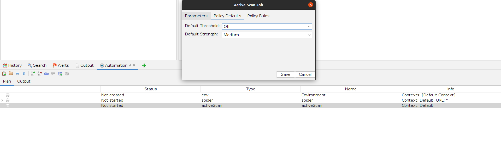
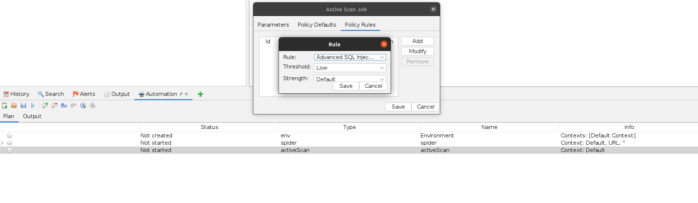

# OWASP ZAP automation

The OWASP ZAP tool is being used in this learning track to find the vulnerabilities and verify the secure implementation.  

## Setting up Automation Framework

- Open Zap

- Click here to add a new tab

- Select **Automation Framework**

- To load a .yaml configuration file, click on the **Load** button. To create a new plan, click on the **New** button

- Select the jobs you want to run

- Set the **Target** by double clicking **env**, modify Default Context, add URL

- Select only the policies you want to run

## Docs

- https://www.zaproxy.org/docs/desktop/addons/automation-framework/
- https://www.zaproxy.org/docs/automate/automation-framework/
